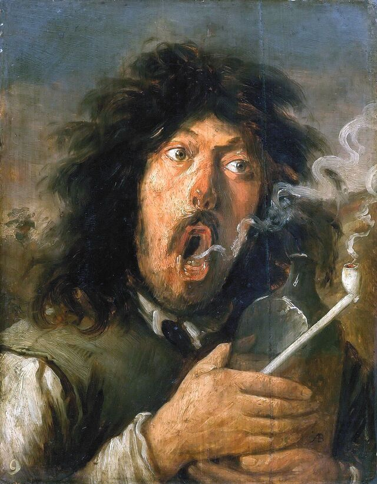

# Spasiu's Weblog

The scratchpad of my life.

## [draft] It's that time of the month 2025.09.05

...

## [draft] How I made this blog site 2025.09.04

...

## Living Ergonomically One 2025.09.03

I'm curious what would happen if I payed attention to how I felt inside and outside, and tried to be as comfortabel as possible. Like walking down the street, trying to walk as comfortably as possible. Going to a party, doing what I need to feel at ease. Just being ergonomic.

## Inner Dialogue One 2025.09.03

What if my inner voice just asked questions? What if it didn't gife me answers? What if it didn't make statements or judgements? Could be a fun experiment.

Maybe sometimes my inner voice will make a statement or a judgement, or respond to a question. And I'll just say "What if that was a question?"

- _That person doesn't like me._ -> _What if that person doesn't like me?_
- _You're not good enough._ -> _What if you're not good enough?_
- _I don't feel good right now._ -> _How do I feel right now?_
- ...

Why questions might be sort of judgey, so perhaps I'll stick to **_how?_** and **_what?_** and **_could?_**, instead of **_why?_** and **_should?_** In spirit if not to the letter. It's all a big experiment.

## Twenty Psychoactive Questions 2025.09.02

This list is taken from the Art of Accomplishment mailing list. You can [subscribe to the mailing list here](https://www.artofaccomplishment.com/).

- [ ] What happens to your mind when you listen to the silence rather than the noise around you right now?
- [ ] If you can't go into the future or the past for proof, what (if anything) is broken or "not enough" about who you are right now?
- [ ] If you improved everything you think you need to improve to be good enough, what would you need then to be enough?
- [ ] How do you enjoy this moment 10% more without changing what you're doing?
- [ ] How did you improve as a kid when you hadn't yet learned how to beat yourself up?
- [ ] What are you pretending to not know?
- [ ] What is your confusion protecting you from?
- [ ] What do you feel in your body after you say “I love myself” 10 times?
- [ ] What do you want, that you don’t let yourself want?
- [ ] What is the part of you that has never changed?
- [ ] What's the scary thing you're not telling someone?
- [ ] What's the scary thing you're not telling yourself?
- [ ] What’s the payoff of holding on to your current identity?
- [ ] What’s the emotion you most avoid, and what would it be like to feel it fully?
- [ ] What are you getting out of being stuck?
- [ ] What is the fear beneath the fear?
- [ ] What do you think is unforgivable in yourself, and who taught you that?
- [ ] What would your life look like if you had no fear giving and receiving love—to yourself, and others?
- [ ] What would you do if there were no way for you to ever prove yourself?
- [ ] Who would you be if you knew you could never get it wrong?

## My September Reading List 2025.09.01

Stuff I want to read. Mostly biology and machine learning themed.

- [ ] **Charles Darwin — _On the Origin of Species_** [Reading on Remarkable](https://darwin-online.org.uk/converted/pdf/1861_OriginNY_F382.pdf)
- [ ] **Erwin Schrödinger — _What Is Life?_** [Listening on Audible](https://www.audible.ca/pd/What-Is-Life-Audiobook/1541446410)
- [ ] **Paul Nurse — _What Is Life? Five Great Ideas in Biology_**
- [ ] [**Horace Freeland Judson — _The Eighth Day of Creation_**](https://archive.org/details/eighthdayofcreat00juds)
- [ ] [**Theodosius Dobzhansky — _Genetics and the Origin of Species_**](https://archive.org/details/geneticsoriginfo00dobz)
- [ ] [**R. A. Fisher — _The Genetical Theory of Natural Selection_**](https://archive.org/download/geneticaltheoryo031631mbp/geneticaltheoryo031631mbp.pdf)
- [ ] [**J. B. S. Haldane — _The Causes of Evolution_**](https://jbshaldane.org/books/1932-Causes-of-Evolution/haldane-1932-causes-of-evolution-flat.pdf)
- [ ] **George Gaylord Simpson — _Tempo and Mode in Evolution_**
- [ ] [**Sewall Wright (1931) — “Evolution in Mendelian Populations”**](https://pmc.ncbi.nlm.nih.gov/articles/PMC1201091/pdf/)
- [ ] [**Bruce Alberts et al. — _Molecular Biology of the Cell_**](https://www.ncbi.nlm.nih.gov/books/NBK21054/)
- [ ] **(Lehninger) — _Principles of Biochemistry_**
- [ ] [**James D. Watson et al. — _Molecular Biology of the Gene_**](https://archive.org/details/molecularbiology0000wats)
- [ ] [**Mark Ptashne — _A Genetic Switch_**](https://archive.org/details/geneticswitchgen0000ptas)
- [ ] [**Watson & Crick (1953) — “Molecular Structure of Nucleic Acids”**](https://www.nature.com/scitable/content/16331/molecularstructureofDNAswatsoncrick.pdf)
- [ ] [**Meselson & Stahl (1958) — Replication of DNA in _E. coli_**](https://pmc.ncbi.nlm.nih.gov/articles/PMC528642/)
- [ ] [**François Jacob & Jacques Monod (1961) — Operon papers**](https://www.scienceintheclassroom.org/sites/default/files/operon.pdf)
- [ ] [**Marshall Nirenberg & Har Gobind Khorana — Genetic code papers**](https://www.pnas.org/content/pnas/54/6/1790.full.pdf)
- [ ] [**Richard C. Lewontin & Motoo Kimura — Neutral theory**](https://www.nature.com/articles/217624a0.pdf)
- [ ] **David L. Nelson & Michael M. Cox — _Lehninger Principles of Biochemistry_**
- [ ] **Susan R. Wessler et al. (Griffiths et al.) — _An Introduction to Genetic Analysis_**
- [ ] [**Leland H. Hartwell et al. — _Genetics: From Genes to Genomes_**](https://archive.org/details/hartwellgeneticsfromgenestogenomes4thtxtbk)
- [ ] [**Daniel L. Hartl & Andrew G. Clark — _Principles of Population Genetics_**](https://archive.org/details/B-001-001-062)
- [ ] **Lewis Wolpert et al. — _Principles of Development_**
- [ ] [**Salvador E. Luria & Max Delbrück (1943) — Fluctuation test paper**](https://www.genetics.org/content/28/6/491.full.pdf)
- [ ] [**Early Hox gene papers (Lewis, Nüsslein‑Volhard & Wieschaus)**](https://www.pnas.org/content/pnas/75/12/5640.full.pdf)
- [ ] **Jonathan Pevsner — _Bioinformatics and Functional Genomics_**
- [ ] [**Phillip Compeau & Pavel A. Pevzner — _Bioinformatics Algorithms_**](https://bioinformaticsalgorithms.com/books/Bioinformatics-Algorithms-2nd-Edition-Vol1.pdf)
- [ ] **Masatoshi Nei & Sudhir Kumar — _Molecular Evolution and Phylogenetics_**
- [ ] **Joseph Felsenstein — _Inferring Phylogenies_**
- [ ] [**McDonald & Kreitman (1991) — McDonald–Kreitman test**](https://www.nature.com/articles/351652a0.pdf)
- [ ] **Tom Strachan & Andrew Read — _Human Molecular Genetics_**
- [ ] **Kenneth Lange — _Statistical Genetics: Gene Mapping through Linkage and Association_**
- [ ] [**Joseph Sambrook & David W. Russell — _Molecular Cloning: A Laboratory Manual_**](https://archive.org/details/MolecularCloningALaboratoryManual)
- [ ] [**Martin Jinek et al. (2012) — CRISPR‑Cas9 paper**](https://www.science.org/doi/pdf/10.1126/science.1225829)
- [ ] [**Human Genome Project papers (2001; Nature & Science)**](https://www.nature.com/articles/35057062.pdf)
- [ ] [**GenBank (1982) — database launch papers**](https://www.science.org/doi/pdf/10.1126/science.6274107)
- [ ] [**William R. Pearson & David J. Lipman (1985) — FASTA**](https://www.pnas.org/content/pnas/85/8/2444.full.pdf)
- [ ] [**Stephen F. Altschul et al. (1990) — BLAST**](https://blast.ncbi.nlm.nih.gov/blast/Blast.cgi?CMD=Web&PAGE_TYPE=BlastDocs&DOC_TYPE=Reference)
- [ ] [**Protein Data Bank (1971) — founding paper**](https://www.rcsb.org/pdb/static.do?p=general_information/pdb_publications.html)
- [ ] [**Saul B. Needleman & Christian D. Wunsch (1970) — global alignment**](https://www.jhu.edu/sergei/wunsch.pdf)
- [ ] [**Temple F. Smith & Michael S. Waterman (1981) — local alignment**](https://academic.oup.com/nar/article-pdf/2/11/215)
- [ ] [**Anders Krogh et al. (1994) — profile HMMs for proteins**](https://www.sciencedirect.com/science/article/pii/S0022283684702437)
- [ ] [**Samuel Karlin & Stephen F. Altschul (1990) — BLAST statistics (E‑values)**](https://www.pnas.org/content/pnas/87/16/6268.full.pdf)
- [ ] [**Joseph Felsenstein (1981) — Maximum‑likelihood phylogenetics**](https://evolution.genetics.washington.edu/lamarc/phyloEM.pdf)
- [ ] [**Naruya Saitou & Masatoshi Nei (1987) — Neighbor‑joining**](https://oup.silverchair-cdn.com/oup/backfile/Content_public/Journal/mbe/4/4/10.1093_molbev_4.4.406/2/mbe040406.pdf)
- [ ] [**J. Craig Venter et al. (1998) — Whole‑genome shotgun assembly**](https://www.science.org/doi/pdf/10.1126/science.280.5369.1540)
- [ ] [**Ali Mortazavi et al. (2008) — RNA‑Seq**](https://www.nature.com/articles/nmeth.1226.pdf)
- [ ] [**Daniel S. Johnson et al. (2007) — ChIP‑Seq**](https://genome.cshlp.org/content/17/4/503.full.pdf)
- [ ] [**Des Higgins & Paul M. Sharp (1988) — CLUSTAL**](https://pubmed.ncbi.nlm.nih.gov/2849750/)
- [ ] [**Swiss‑Prot / UniProt (1986+) — curated protein knowledgebase**](https://academic.oup.com/nar/article-pdf/32/suppl_1/D115)
- [ ] [**STRING database papers (early 2000s) — protein–protein interactions**](https://academic.oup.com/nar/article-pdf/31/1/258)
- [ ] [**KEGG (1997) — Kyoto Encyclopedia of Genes and Genomes**](https://academic.oup.com/nar/article-pdf/27/1/29)
- [ ] [**Arthur M. Lesk — _Introduction to Bioinformatics_**](https://archive.org/details/introductiontobi0000lesk)
- [ ] [**David W. Mount — _Bioinformatics: Sequence and Genome Analysis_**](https://archive.org/details/bioinformaticsse0000moun)
- [ ] **Richard Durbin, Sean R. Eddy, Anders Krogh & Graeme Mitchison — _Biological Sequence Analysis_**
- [ ] [**Annual Review of Genomics and Human Genetics (journal)**](https://www.annualreviews.org/journal/genom)
- [ ] [**Eric Wang, Mark Gerstein & Michael Snyder (2009) — “RNA‑Seq: a revolutionary tool for transcriptomics”**](https://www.nature.com/articles/nrg2484.pdf)
- [ ] [**Michael S. Lawrence et al. (2014) — “Bioinformatics for cancer genomics”**](https://cancerdiscovery.aacrjournals.org/content/candisc/4/1/47.full.pdf)
- [ ] [**Seonwoo Min et al. (2017) — Deep learning in bioinformatics (survey)**](https://academic.oup.com/bib/article-pdf/20/2/154)
- [ ] [**James Zou et al. (2019) — Deep learning in genomics/bioinformatics (survey)**](https://www.nature.com/articles/s41576-018-0135-0.pdf)
- [ ] [**Evan Z. Macosko et al. (2015) — Drop‑seq**](https://www.cell.com/cell/pdf/S0092-8674%2815%2900549-8.pdf)
- [ ] [**Grace X. Y. Zheng et al. (2017) — 10x Chromium single‑cell assay**](https://www.nature.com/articles/ncomms14049.pdf)
- [ ] [**Seurat (papers/software)**](https://www.nature.com/articles/nmeth.4612.pdf)
- [ ] [**Scanpy (papers/software)**](https://genomebiology.biomedcentral.com/track/pdf/10.1186/s13059-017-1382-0.pdf)
- [ ] [**Luecken & Theis (2019) — single‑cell RNA‑seq best practices**](https://www.nature.com/articles/s41592-019-0550-2.pdf)
- [ ] [**Heng Li et al. (2009) — SAM/BAM and SAMtools**](https://academic.oup.com/bioinformatics/article-pdf/25/16/2078/523092)
- [ ] [**Petr Danecek et al. (2011) — VCF/VCFtools**](https://academic.oup.com/bioinformatics/article-pdf/27/15/2156/5281331)
- [ ] [**John Jumper et al. (2021) — AlphaFold2**](https://www.nature.com/articles/s41586-021-03819-2.pdf)
- [ ] [__Peter E. Hart, Nils J. Nilsson & Bertram Raphael (1968) — A_ search_*](https://www.cs.auckland.ac.nz/courses/compsci709s2c/resources/Mike.d/astarNilsson.pdf)
- [ ] [**Richard E. Fikes & Nils J. Nilsson (1971) — STRIPS planning**](https://ai.stanford.edu/~nilsson/STRIPS.pdf)
- [ ] [**J. Alan Robinson (1965) — Resolution principle**](https://courses.engr.illinois.edu/cs598ps/assets/notes/robinson-resolution.pdf)
- [ ] [**Martin Davis, Hilary Putnam, George Logemann & Donald Loveland (1962) — DPLL**](https://www.cs.toronto.edu/~bor/Papers/Classic/dpll.pdf)
- [ ] [**Rudolf E. Kálmán (1960) — Kalman filter**](https://courses.cs.duke.edu/compsci527/cps274/fall11/papers/Kalman60.pdf)
- [ ] [**Arthur P. Dempster, Nan M. Laird & Donald B. Rubin (1977) — EM algorithm**](https://www.jstor.org/stable/2984882)
- [ ] **Judea Pearl (1988) — _Probabilistic Reasoning in Intelligent Systems_**
- [ ] [**Herbert Robbins & Sutton Monro (1951) — Stochastic approximation**](https://www.jstor.org/stable/2238007)
- [ ] [**Boris Polyak (1964) — Heavy‑ball momentum**](https://www.mathnet.ru/eng/izv8540)
- [ ] [**Yurii Nesterov (1983) — Accelerated gradient method**](https://core.ac.uk/download/pdf/82462031.pdf)
- [ ] [**Diederik P. Kingma & Jimmy Ba (2015) — Adam**](https://arxiv.org/pdf/1412.6980.pdf)
- [ ] [**David E. Rumelhart, Geoffrey E. Hinton & Ronald J. Williams (1986) — Backpropagation**](https://www.nature.com/articles/323533a0.pdf)
- [ ] [**Sepp Hochreiter & Jürgen Schmidhuber (1997) — LSTM**](https://www.bioinf.jku.at/publications/older/2604.pdf)
- [ ] [**Yann LeCun et al. (1998) — LeNet**](http://yann.lecun.com/exdb/publis/pdf/lecun-98.pdf)
- [ ] [**Alex Krizhevsky, Ilya Sutskever & Geoffrey Hinton (2012) — AlexNet**](https://proceedings.neurips.cc/paper_files/paper/2012/file/c399862d3b9d6b76c8436e924a68c45b-Paper.pdf)
- [ ] [**Karen Simonyan & Andrew Zisserman (2014) — VGG**](https://arxiv.org/pdf/1409.1556.pdf)
- [ ] [**Kaiming He et al. (2016) — ResNet**](https://arxiv.org/pdf/1512.03385.pdf)
- [ ] [**Sergey Ioffe & Christian Szegedy (2015) — Batch Normalization**](https://arxiv.org/pdf/1502.03167.pdf)
- [ ] [**Alexey Dosovitskiy et al. (2020) — Vision Transformer (ViT)**](https://arxiv.org/pdf/2010.11929.pdf)
- [ ] [**Kishore Papineni et al. (2002) — BLEU**](https://aclanthology.org/P02-1040.pdf)
- [ ] [**Tomas Mikolov et al. (2013) — word2vec**](https://arxiv.org/pdf/1301.3781.pdf)
- [ ] [**Ilya Sutskever, Oriol Vinyals & Quoc V. Le (2014) — Seq2Seq**](https://arxiv.org/pdf/1409.3215.pdf)
- [ ] [**Dzmitry Bahdanau, Kyunghyun Cho & Yoshua Bengio (2015) — Attention for NMT**](https://arxiv.org/pdf/1409.0473.pdf)
- [ ] [**Ashish Vaswani et al. (2017) — “Attention Is All You Need”**](https://arxiv.org/pdf/1706.03762.pdf)
- [ ] [**Jacob Devlin et al. (2018) — BERT**](https://arxiv.org/pdf/1810.04805.pdf)
- [ ] [**Colin Raffel et al. (2020) — T5**](https://arxiv.org/pdf/1910.10683.pdf)
- [ ] [**Tom B. Brown et al. (2020) — GPT‑3**](https://arxiv.org/pdf/2005.14165.pdf)
- [ ] [**Jared Kaplan et al. (2020) — Scaling laws for neural LMs**](https://arxiv.org/pdf/2001.08361.pdf)
- [ ] [**Jordan Hoffmann et al. (2022) — Chinchilla compute‑optimal scaling**](https://arxiv.org/pdf/2203.15556.pdf)
- [ ] [**Aaron van den Oord et al. (2018) — CPC / InfoNCE**](https://arxiv.org/pdf/1807.03748.pdf)
- [ ] [**Ting Chen et al. (2020) — SimCLR**](https://arxiv.org/pdf/2002.05709.pdf)
- [ ] [**Kaiming He et al. (2020) — MoCo**](https://arxiv.org/pdf/1911.05722.pdf)
- [ ] [**Jean‑Bastien Grill et al. (2020) — BYOL**](https://arxiv.org/pdf/2006.07733.pdf)
- [ ] [**Alec Radford et al. (2021) — CLIP**](https://arxiv.org/pdf/2103.00020.pdf)
- [ ] [**Diederik P. Kingma & Max Welling (2013) — Variational Autoencoders**](https://arxiv.org/pdf/1312.6114.pdf)
- [ ] [**Ian J. Goodfellow et al. (2014) — GANs**](https://arxiv.org/pdf/1406.2661.pdf)
- [ ] [**Jonathan Ho, Ajay Jain & Pieter Abbeel (2020) — DDPM**](https://arxiv.org/pdf/2006.11239.pdf)
- [ ] [**Robin Rombach et al. (2022) — Latent Diffusion (Stable Diffusion)**](https://arxiv.org/pdf/2112.10752.pdf)
- [ ] [**Richard S. Sutton (1988) — Temporal‑difference learning**](https://www.jair.org/index.php/jair/article/download/10207/24064)
- [ ] [**Christopher J. C. H. Watkins & Peter Dayan (1992) — Q‑learning**](https://www.cs.rhul.ac.uk/~chrisw/IncReinforce.pdf)
- [ ] [**Ronald J. Williams (1992) — REINFORCE**](https://www.cs.toronto.edu/~lczhang/360/lec/williams.pdf)
- [ ] [**Volodymyr Mnih et al. (2015) — Deep Q‑Network (DQN)**](https://www.nature.com/articles/nature14236.pdf)
- [ ] [**David Silver et al. (2016) — AlphaGo**](https://www.nature.com/articles/nature16961.pdf)
- [ ] [**Julian Schrittwieser et al. (2020) — MuZero**](https://arxiv.org/pdf/1911.08265.pdf)
- [ ] [**Paul F. Christiano et al. (2017) — Preference‑based RL (RLHF)**](https://arxiv.org/pdf/1706.03741.pdf)
- [ ] [**Daniel M. Ziegler et al. (2019) — Fine‑tuning language models from human preferences**](https://arxiv.org/pdf/1909.08593.pdf)
- [ ] [**Long Ouyang et al. (2022) — InstructGPT (RLHF for alignment)**](https://arxiv.org/pdf/2203.02155.pdf)
- [ ] [**Yann LeCun, Yoshua Bengio & Geoffrey Hinton (2015) — “Deep learning”**](https://www.nature.com/articles/nature14539.pdf)
- [ ] [**Rishi Bommasani et al. (2021) — Opportunities & Risks of Foundation Models**](https://arxiv.org/pdf/2108.07258.pdf)
- [ ] [**Wayne Xin Zhao et al. (2023) — LLM survey**](https://arxiv.org/pdf/2307.15266.pdf)
- [ ] [**Shahin Minaee et al. (2024) — LLM survey/update**](https://arxiv.org/pdf/2307.08164.pdf)
- [ ] [**Martin J. Wainwright & Michael I. Jordan (2008) — Graphical models & variational inference**](https://people.eecs.berkeley.edu/~wainwrig/Papers/WaiJor2008_FnT.pdf)
- [ ] [**David M. Blei, Alp Kucukelbir & Jon D. McAuliffe (2017) — “Variational Inference: A Review”**](https://arxiv.org/pdf/1601.00670.pdf)
- [ ] [**Songyang (Yang) et al. (2022) — Diffusion models survey**](https://arxiv.org/pdf/2209.00796.pdf)
- [ ] [**Iulia‑Diana Croitoru et al. (2022) — Diffusion models in vision**](https://arxiv.org/pdf/2206.06204.pdf)
- [ ] [**Leslie Pack Kaelbling, Michael L. Littman & Andrew W. Moore (1996) — Reinforcement‑learning survey (JAIR)**](https://www.jair.org/index.php/jair/article/download/10182/24007)
- [ ] [**Yuxi Li (2017) — Deep RL overview**](https://arxiv.org/pdf/1701.07274.pdf)
- [ ] [**Jonas Kaufmann et al. (2023/2024) — RLHF survey**](https://arxiv.org/pdf/2310.01278.pdf)
- [ ] [**Luyu Gao et al. (2023) — RAG survey**](https://arxiv.org/pdf/2308.08745.pdf)
- [ ] [**Yingqiang Huang et al. (2024) — RAG survey**](https://arxiv.org/pdf/2405.00029.pdf)
- [ ] [**Yao et al. (2022) — ReAct (reason+act prompting)**](https://arxiv.org/pdf/2210.03629.pdf)
- [ ] [**Chen Qu et al. (2024) — Tool‑use/agents survey**](https://arxiv.org/pdf/2402.06735.pdf)
- [ ] [**Shiyu (Steven) Gui et al. (2024) — Self‑supervised learning survey**](https://arxiv.org/pdf/2307.01831.pdf)
- [ ] **Daphne Koller & Nir Friedman (2009) — _Probabilistic Graphical Models_**
- [ ] **Christopher M. Bishop (2006) — _Pattern Recognition and Machine Learning_**
- [ ] [**Trevor Hastie, Robert Tibshirani & Jerome Friedman (2009) — _The Elements of Statistical Learning_**](https://web.stanford.edu/~hastie/ElemStatLearn/printings/ESLII_print4.pdf)
- [ ] [**Gareth James, Daniela Witten, Trevor Hastie & Robert Tibshirani (2021) — _An Introduction to Statistical Learning (2e)_**](https://hastie.su.domains/ISLR2/ISLRv2_website.pdf)
- [ ] **Kevin P. Murphy (2022) — _Probabilistic Machine Learning_ (vols. 1–2)**
- [ ] [**Jürgen Schmidhuber (2015) — “Deep Learning in Neural Networks: An Overview”**](https://arxiv.org/pdf/1404.7828.pdf)
- [ ] [**Yoshua Bengio, Aaron Courville & Pascal Vincent (2013) — Representation learning review**](https://arxiv.org/pdf/1206.5538.pdf)
- [ ] [**Vladimir N. Vapnik & Alexey Y. Chervonenkis (1971) — VC theory**](https://link.springer.com/content/pdf/10.1007/BF00994018.pdf)
- [ ] [**Leslie Valiant (1984) — PAC learning**](https://dl.acm.org/doi/pdf/10.1145/800057.808710)
- [ ] **Vladimir N. Vapnik (1995/1998) — _The Nature of Statistical Learning Theory_**
- [ ] [**Hirotugu Akaike (1973) — AIC**](https://www.jstor.org/stable/2683254)
- [ ] [**Gideon Schwarz (1978) — BIC**](https://www.jstor.org/stable/2240369)
- [ ] [**Mervyn Stone (1974) — Cross‑validation foundations**](https://rss.onlinelibrary.wiley.com/doi/pdf/10.1111/j.2517-6161.1974.tb00994.x)
- [ ] [**Karl Pearson (1901) — PCA**](https://royalsocietypublishing.org/doi/pdf/10.1098/rsta.1901.0022)
- [ ] [**Harold Hotelling (1933) — PCA**](https://www.jstor.org/stable/2236101)
- [ ] [**Stuart Lloyd (1982) — k‑means**](https://people.eecs.berkeley.edu/~jrs/papers/Kmeans.pdf)
- [ ] [**Leo Breiman, Jerome Friedman, Charles J. Stone & R. A. Olshen (1984) — CART**](https://www.stat.berkeley.edu/~breiman/breiman_stone.pdf)
- [ ] [**J. R. Quinlan (1986/1993) — ID3 / C4.5**](https://www.ics.uci.edu/~mlearn/Papers/Quinlan86.pdf)
- [ ] [**Hidden Markov Models — Baum–Welch papers (1966–1970)**](https://www.jstor.org/stable/2285209)
- [ ] [**Lawrence R. Rabiner (1989) — HMM tutorial**](https://www.ece.ucf.edu/~ahamad/papers/hmm.pdf)
- [ ] [**John Lafferty, Andrew McCallum & Fernando Pereira (2001) — CRFs**](https://www.cs.cmu.edu/~lafferty/papers/crf.pdf)
- [ ] [**Michael I. Jordan, Zoubin Ghahramani, Tommi Jaakkola & Lawrence Saul (1999) — Variational methods**](https://people.eecs.berkeley.edu/~jordan/papers/variational-methods.pdf)
- [ ] [**Nicholas Metropolis et al. (1953) — Metropolis algorithm**](https://www.mathstat.dal.ca/FQ/Annals/Metropolis53.pdf)
- [ ] [**Anthony Duane et al. (1987) — Hamiltonian Monte Carlo**](https://www.jstor.org/stable/2203361)
- [ ] [**Radford Neal — Hamiltonian Monte Carlo monograph**](https://arxiv.org/pdf/1206.1901.pdf)
- [ ] [**Matthew D. Hoffman & Andrew Gelman (2014) — NUTS**](https://arxiv.org/pdf/1111.4246.pdf)
- [ ] [**Thomas S. Ferguson (1973) — Dirichlet Process**](https://projecteuclid.org/download/pdf_1/euclid.aos/1176342823)
- [ ] [**Jayaram Sethuraman (1994) — Stick‑breaking construction**](https://www.jstor.org/stable/2241839)
- [ ] [**Yee Whye Teh et al. (2006) — Hierarchical Dirichlet Process**](https://arxiv.org/pdf/cs/0607096.pdf)
- [ ] [**Arthur E. Hoerl & Robert W. Kennard (1970) — Ridge regression**](https://www.osti.gov/servlets/purl/5032528)
- [ ] [**Robert Tibshirani (1996) — LASSO**](https://www.jstor.org/stable/2346178)
- [ ] [**Hui Zou & Trevor Hastie (2005) — Elastic Net**](https://web.stanford.edu/~hastie/Papers/elasticnet.pdf)
- [ ] [**Stephen Boyd & Lieven Vandenberghe (2004) — _Convex Optimization_**](https://web.stanford.edu/~boyd/cvxbook/bv_cvxbook.pdf)
- [ ] [**Arkadi Nemirovski & David Yudin (1983) — Mirror descent/complexity in optimization**](https://web.stanford.edu/class/cme323/notes/MirrorDescent.pdf)
- [ ] [**Amir Beck & Marc Teboulle (2009) — FISTA/proximal gradient**](https://www.math.tau.ac.il/~teboulle/downloads/BecTeb_OPTIM.pdf)
- [ ] [**Stephen Boyd et al. (2011) — ADMM survey**](https://web.stanford.edu/~boyd/papers/pdf/admm_distr_stats.pdf)
- [ ] [**Xavier Glorot & Yoshua Bengio (2010) — Xavier initialization**](https://proceedings.mlr.press/v9/glorot10a/glorot10a.pdf)
- [ ] [**Kaiming He et al. (2015) — He initialization**](https://arxiv.org/pdf/1502.01852.pdf)
- [ ] [**Nitish Srivastava et al. (2014) — Dropout**](https://arxiv.org/pdf/1409.2329.pdf)
- [ ] [**Jimmy Lei Ba, Jamie Ryan Kiros & Geoffrey E. Hinton (2016) — Layer Normalization**](https://arxiv.org/pdf/1607.06450.pdf)
- [ ] [**Geoffrey Hinton & Terrence J. Sejnowski (1985) — Boltzmann machines**](https://www.cs.toronto.edu/~hinton/absps/boltz.pdf)
- [ ] [**Geoffrey E. Hinton, Simon Osindero & Yee Whye Teh (2006) — Deep Belief Networks**](https://www.cs.toronto.edu/~hinton/absps/dbn.pdf)
- [ ] [**Aapo Hyvärinen & Erkki Oja (2000) — Independent Component Analysis**](https://www.jmlr.org/papers/volume4/hyvarinen03a/hyvarinen03a.pdf)
- [ ] [**Daniel D. Lee & H. Sebastian Seung (1999) — Non‑negative Matrix Factorization**](https://papers.nips.cc/paper_files/paper/1999/file/1fb57c57bc25108bdc8a4bbd7f984d53-Paper.pdf)
- [ ] [**Yehuda Koren, Robert Bell & Chris Volinsky (2009) — Matrix factorization for recommender systems**](https://ieeexplore.iee.org/stamp/stamp.jsp?arnumber=5197422)
- [ ] [**Rico Sennrich, Barry Haddow & Alexandra Birch (2016) — BPE subword tokenization**](https://arxiv.org/pdf/1609.08144.pdf)
- [ ] [**Taku Kudo & John Richardson (2018) — SentencePiece**](https://arxiv.org/pdf/1808.06226.pdf)
- [ ] [**Jeremy Howard & Sebastian Ruder (2018) — ULMFiT**](https://arxiv.org/pdf/1801.06146.pdf)
- [ ] [**Matthew E. Peters et al. (2018) — ELMo**](https://arxiv.org/pdf/1802.05365.pdf)
- [ ] [**Franco Scarselli et al. (2008) — Graph Neural Networks**](https://ieeexplore.ieee.org/stamp/stamp.jsp?arnumber=4700287)
- [ ] [**Thomas N. Kipf & Max Welling (2017) — Graph Convolutional Networks**](https://arxiv.org/pdf/1609.02907.pdf)
- [ ] [**Petar Veličković et al. (2018) — Graph Attention Networks**](https://arxiv.org/pdf/1710.10903.pdf)
- [ ] [**Joan Bruna et al. (2013) — Spectral CNNs on graphs**](https://arxiv.org/pdf/1312.6203.pdf)
- [ ] [**Chelsea Finn, Pieter Abbeel & Sergey Levine (2017) — MAML**](https://arxiv.org/pdf/1703.03400.pdf)
- [ ] [**Oriol Vinyals et al. (2016) — Matching Networks**](https://arxiv.org/pdf/1606.04080.pdf)
- [ ] [**Jake Snell, Kevin Swersky & Richard Zemel (2017) — Prototypical Networks**](https://arxiv.org/pdf/1703.05175.pdf)
- [ ] [**Geoffrey Hinton, Oriol Vinyals & Jeff Dean (2015) — Knowledge Distillation**](https://arxiv.org/pdf/1503.02531.pdf)
- [ ] [**Jonathan Frankle & Michael Carbin (2019) — Lottery Ticket Hypothesis**](https://arxiv.org/pdf/1803.03635.pdf)
- [ ] [**Song Han, Huizi Mao & William J. Dally (2015) — Deep Compression**](https://arxiv.org/pdf/1510.00149.pdf)
- [ ] [**Laurent Dinh, David Krueger & Yoshua Bengio (2014) — NICE**](https://arxiv.org/pdf/1410.8516.pdf)
- [ ] [**Laurent Dinh, Jascha Sohl‑Dickstein & Samy Bengio (2016) — RealNVP**](https://arxiv.org/pdf/1605.08803.pdf)
- [ ] [**Diederik P. Kingma & Prafulla Dhariwal (2018) — Glow**](https://arxiv.org/pdf/1807.03039.pdf)
- [ ] [**Jiaming Song, Chenlin Meng & Stefano Ermon (2020) — DDIM**](https://arxiv.org/pdf/2010.02502.pdf)
- [ ] [**Jonathan Ho & Tim Salimans (2021) — Classifier‑free guidance**](https://arxiv.org/pdf/2101.04775.pdf)
- [ ] [**Richard S. Sutton, David McAllester, Satinder Singh & Yishay Mansour (1999) — Policy gradient theorem**](https://papers.nips.cc/paper_files/paper/1999/file/464d828b85b0f4b8bd328e46c2e89c00-Paper.pdf)
- [ ] [**John Schulman et al. (2015) — TRPO**](https://arxiv.org/pdf/1502.05477.pdf)
- [ ] [**Timothy P. Lillicrap et al. (2015) — DDPG**](https://arxiv.org/pdf/1509.02971.pdf)
- [ ] [**Scott Fujimoto, Herke van Hoof & David Meger (2018) — TD3**](https://arxiv.org/pdf/1802.09477.pdf)
- [ ] [**David Silver et al. (2017) — AlphaZero**](https://arxiv.org/pdf/1712.01815.pdf)
- [ ] [**Dean Pomerleau (1989) — ALVINN/behavioral cloning**](https://www.ri.cmu.edu/pub_files/pub3/pomerleau_dean_a_1989_1/pomerleau_dean_a_1989_1.pdf)
- [ ] [**Stéphane Ross, Geoffrey Gordon & Drew Bagnell (2011) — DAgger**](https://arxiv.org/pdf/1011.0686.pdf)
- [ ] [**Jonathan Ho & Stefano Ermon (2016) — GAIL**](https://arxiv.org/pdf/1606.03476.pdf)
- [ ] [**Aviral Kumar et al. (2020) — CQL**](https://arxiv.org/pdf/2006.04779.pdf)
- [ ] [**Marc Peter Deisenroth & Carl Edward Rasmussen (2011) — PILCO**](https://ml.informatik.uni-freiburg.de/_media/publikationen/deisenroth11pilco.pdf)
- [ ] [**Danijar Hafner et al. (2019/2020) — Dreamer**](https://arxiv.org/pdf/1912.01603.pdf)
- [ ] [**Cynthia Dwork et al. (2006) — Differential Privacy**](https://www.microsoft.com/en-us/research/wp-content/uploads/2016/02/privacy.pdf)
- [ ] [**H. Brendan McMahan et al. (2017) — Federated Averaging**](https://arxiv.org/pdf/1602.05629.pdf)
- [ ] [**Michael McCloskey & Neal J. Cohen (1989) — Catastrophic forgetting**](https://psycnet.apa.org/fulltext/1989-17672-001.pdf)
- [ ] [**James Kirkpatrick et al. (2017) — Elastic Weight Consolidation**](https://arxiv.org/pdf/1612.00796.pdf)
- [ ] [**Ian J. Goodfellow, Jonathon Shlens & Christian Szegedy (2015) — Adversarial examples**](https://arxiv.org/pdf/1412.6572.pdf)
- [ ] [**Aleksander Madry et al. (2017) — PGD adversarial training**](https://arxiv.org/pdf/1706.06083.pdf)
- [ ] [**Mukund Sundararajan, Ankur Taly & Qiqi Yan (2017) — Integrated Gradients**](https://arxiv.org/pdf/1703.01365.pdf)
- [ ] [**Scott M. Lundberg & Su‑In Lee (2017) — SHAP**](https://arxiv.org/pdf/1705.07874.pdf)
- [ ] [**Moritz Hardt, Eric Price & Nati Srebro (2016) — Equality of Opportunity**](https://arxiv.org/pdf/1610.02413.pdf)
- [ ] [**Matt J. Kusner, Joshua Loftus, Chris Russell & Ricardo Silva (2017) — Counterfactual fairness**](https://arxiv.org/pdf/1703.06856.pdf)
- [ ] [**Marco Tulio Ribeiro, Sameer Singh & Carlos Guestrin (2016) — LIME**](https://arxiv.org/pdf/1602.04938.pdf)
- [ ] [**Sandra Wachter, Brent Mittelstadt & Chris Russell (2017) — Counterfactual explanations**](https://arxiv.org/pdf/1702.07608.pdf)
- [ ] [**Jeremy M. Cohen, Elan Rosenfeld & J. Zico Kolter (2019) — Randomized smoothing**](https://arxiv.org/pdf/1902.02918.pdf)
- [ ] [**Shai Ben-David et al. (2010) — Domain adaptation (theory)**](https://arxiv.org/pdf/0902.3430.pdf)
- [ ] [**Martin Arjovsky, Léon Bottou, Ishaan Gulrajani & David Lopez‑Paz (2019) — Invariant Risk Minimization**](https://arxiv.org/pdf/1907.02893.pdf)
- [ ] [**Pang Wei Koh et al. (2021) — WILDS benchmark**](https://arxiv.org/pdf/2012.07421.pdf)
- [ ] [**Noam Shazeer et al. (2017) — Outrageously Large Neural Networks (Mixture‑of‑Experts)**](https://arxiv.org/pdf/1701.06538.pdf)
- [ ] [**William Fedus, Barret Zoph & Noam Shazeer (2021) — Switch Transformer**](https://arxiv.org/pdf/2101.03961.pdf)
- [ ] [**Ari Holtzman et al. (2020) — Nucleus (top‑p) sampling**](https://arxiv.org/pdf/1904.09751.pdf)
- [ ] [**Albert Gu, Karan Goel & Christopher Ré (2021) — S4 (state‑space models)**](https://arxiv.org/pdf/2105.02192.pdf)
- [ ] [**Albert Gu & Tri Dao (2023/2024) — Mamba (selective SSMs)**](https://arxiv.org/pdf/2312.09153.pdf)
- [ ] [**Varun Gadre et al. (2023) — DataComp benchmark**](https://arxiv.org/pdf/2304.06762.pdf)
- [ ] [**Mikhail Belkin et al. (2019) — Double descent**](https://arxiv.org/pdf/1812.11118.pdf)
- [ ] [**Pierre Foret, Ariel Kleiner, Huy Nguyen & Behnam Neyshabur (2021) — SAM optimizer**](https://arxiv.org/pdf/2010.01412.pdf)
- [ ] **Judea Pearl — _Causality_**
- [ ] **Guido W. Imbens & Donald B. Rubin — _Causal Inference_ (2015)**
- [ ] **Ron Kohavi, Diane Tang & Ya Xu — _Trustworthy Online Controlled Experiments_**
- [ ] [**Tor Lattimore & Csaba Szepesvári — _Bandit Algorithms_**](https://tor-lattimore.com/downloads/book/book.pdf)
- [ ] [**Reza Shokri et al. (2017) — Membership inference attacks**](https://arxiv.org/pdf/1610.05820.pdf)
- [ ] **Andrey N. Kolmogorov (1933) — _Axioms of probability_ (Foundations of Probability)**
- [ ] [**Jerzy Neyman & Egon Pearson (1933) — Hypothesis testing framework**](https://projecteuclid.org/download/pdf_1/euclid.aoms/1177733182)
- [ ] [**Fisher (1918–1935) — ANOVA & maximum likelihood**](https://royalsocietypublishing.org/doi/pdf/10.1098/rsta.1922.0008)
- [ ] [**Claude E. Shannon (1948) — _A Mathematical Theory of Communication_**](https://people.cs.pitt.edu/~milos/courses/cs2731/Lectures/class18.pdf)
- [ ] [**C. R. Rao (1945) — Cramér–Rao lower bound**](https://www.jstor.org/stable/2332561)
- [ ] [**John W. Tukey (1949) — Early exploratory data analysis**](https://projecteuclid.org/download/pdf_1/euclid.aoas/1176325452)
- [ ] [**Bradley Efron (1979) — Bootstrap**](https://statweb.stanford.edu/~ckirby/brad/Other/1979NegativeBootstrap.pdf)
- [ ] [**Emanuel Parzen (1962) — Kernel density estimation**](https://projecteuclid.org/download/pdf_1/euclid.aoms/1177704472)
- [ ] [**Elizbar Nadaraya (1964) & Geoffrey Watson (1964) — Kernel regression**](https://projecteuclid.org/download/pdf_1/euclid.aoms/1177704474)
- [ ] [**Charles J. Stone (1977) — Consistency of nonparametric regression**](https://www.jstor.org/stable/2240365)
- [ ] **Kendall’s Advanced Theory of Statistics (volumes)**
- [ ] **Harald Cramér (1946) — _Mathematical Methods of Statistics_**
- [ ] **Erich L. Lehmann & George Casella — _Theory of Point Estimation_**
- [ ] **Erich L. Lehmann & Joseph P. Romano — _Testing Statistical Hypotheses_**
- [ ] **C. R. Rao (1973) — _Linear Statistical Inference and Its Applications_**
- [ ] [**Larry Wasserman (2004) — _All of Statistics_**](https://www.stat.cmu.edu/~cshalizi/ADAfaEPoD/All_of_statistics.pdf)
- [ ] **Andrew Gelman et al. — _Bayesian Data Analysis (3rd ed.)_**
- [ ] **George E. P. Box & Gwilym M. Jenkins — _Time Series Analysis: Forecasting and Control_**
- [ ] [**Rob J. Hyndman & George Athanasopoulos — _Forecasting: Principles and Practice_**](https://otexts.com/fpp3/)
- [ ] [**Michael M. Bronstein et al. — “Geometric Deep Learning”**](https://arxiv.org/pdf/2104.13478.pdf)
- [ ] [**Zonghan Wu et al. — Survey on graph neural networks**](https://arxiv.org/pdf/2011.08235.pdf)
- [ ] **William L. Hamilton — _Graph Representation Learning_**
- [ ] [**Snakemake — workflow engine paper**](https://snakemake.readthedocs.io/en/stable/_downloads/71cfe5870b995e56c8c43259c59e86f9/snakemake-paper.pdf)
- [ ] [**Nextflow — workflow engine paper**](https://academic.oup.com/bioinformatics/article-pdf/34/17/3094)
- [ ] [**Annual Review–style primer on five central ideas in biology**](https://www.annualreviews.org/journal/genet)
- [ ] [**Review on replication/transcription/translation mechanics**](https://elifesciences.org/articles/03193.pdf)
- [ ] [**Review on enhancers, promoters, chromatin; morphogen gradients**](https://www.nature.com/articles/nrg.2018.15.pdf)
- [ ] [**Review on mutation origins and rates; linkage & recombination**](https://www.annualreviews.org/doi/pdf/10.1146/annurev.genet.37.110801.143352)
- [ ] [**Review on effective population size, selection coefficients, F‑statistics**](https://www.nature.com/articles/nrg3375.pdf)
- [ ] [**Review on substitution models and dN/dS interpretation**](https://www.annualreviews.org/doi/pdf/10.1146/annurev.genet.40.110405.090419)
- [ ] [**Review on RNA‑seq or ATAC‑seq from reads to results**](https://www.ncbi.nlm.nih.gov/pmc/articles/PMC5632992/pdf/nihms896819.pdf)
- [ ] [**Review on GWAS design, population structure, multiple testing**](https://www.nature.com/articles/nrg3042.pdf)
- [ ] [**Review on network motifs & gene regulatory networks (GRNs)**](https://www.nature.com/articles/nrg.2016.132.pdf)
- [ ] [**Review on CRISPR design/off‑target & therapeutic constraints**](https://www.nature.com/articles/nrg.2017.16.pdf)
- [ ] [**Monograph chapter on single‑cell RNA‑seq concepts**](https://www.nature.com/articles/nrg3779.pdf)
- [ ] [**Review on single‑cell workflows (QC→clustering→markers)**](https://arxiv.org/pdf/1707.00088.pdf)
- [ ] [**Meta‑learning surveys (post‑2018)**](https://arxiv.org/pdf/2004.11370.pdf)
- [ ] [**Kairouz et al. (2019/2021) — Federated learning surveys**](https://arxiv.org/pdf/1912.04977.pdf)
- [ ] [**Finale Doshi‑Velez & Been Kim (2017) — Interpretability survey**](https://arxiv.org/pdf/1702.08608.pdf)
- [ ] [**Agents & tool‑use survey (2024/2025)**](https://arxiv.org/pdf/2403.08972.pdf)
